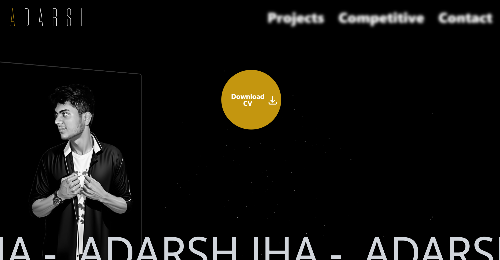
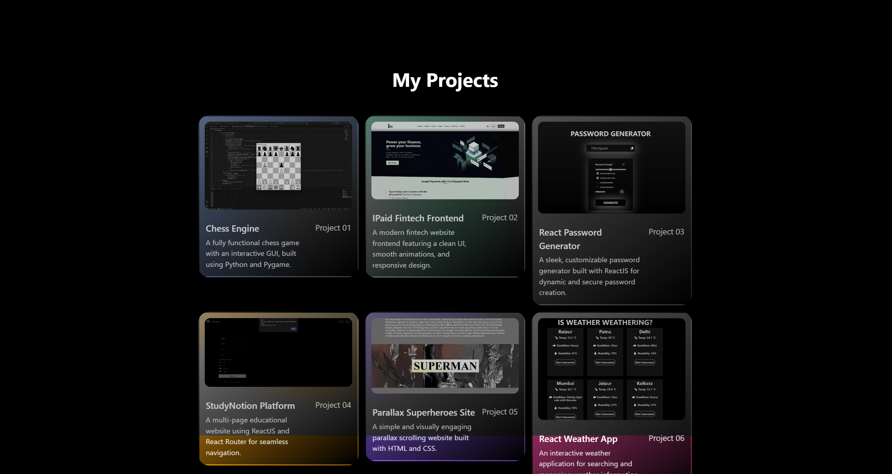
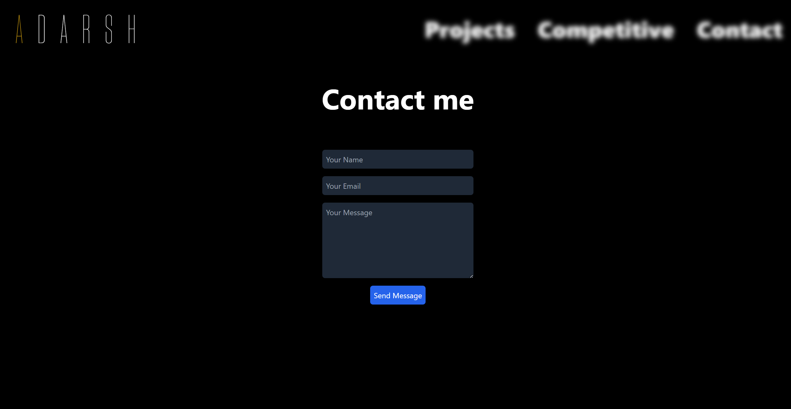

# My Portfolio Website

A modern, full-stack, animated developer portfolio built with **React**, **Tailwind CSS**, and **Framer Motion**, featuring a functional **contact form powered by Node.js and Nodemailer**. The site is fully responsive, visually engaging, and hosted with seamless deployment on Vercel and Render.

## 🌐 Live Demo

🔗 [Visit My Portfolio](https://adarshjha.vercel.app/)

---

## 🛠 Tech Stack

### Frontend

- React
- Tailwind CSS
- Framer Motion
- React Router DOM

### Backend

- Node.js
- Express.js
- Nodemailer
- CORS, dotenv

### Hosting

- **Frontend:** [Vercel](https://vercel.com/)
- **Backend:** [Render](https://render.com/)

---

## 📄 Pages Included

- **🌀 Preloader** – Intro animation before page loads
- **🏠 Home** – Hero, intro text, scroll effects, and CTA
- **💼 Projects** – Carousel or grid view of projects with smooth animation
- **🏆 Competitive Programming Profiles** – Links to Codeforces, LeetCode, and more
- **📞 Contact** – Real-time email form with backend support

---

## ✨ Features

- 🎬 **Framer Motion Page Transitions** – Black bars slide in with page title
- ⏳ **Preloader** – Animated intro for smoother UX
- 💡 **Magnet-style Buttons** – Interactive hover effects
- 🖼️ **Project Showcase** – With animations and hover interactions
- 💌 **Contact Form with Nodemailer** – Sends emails directly from the website
- 🔗 **Competitive Programming Section** – Links to live CP profiles
- 📱 **Fully Responsive** – Mobile, tablet, and desktop friendly
- 🚀 **Deployed Live** – Frontend on Vercel, Backend on Render

---

## 📷 Images

> Add your images in a `/screenshots` folder in the root of your project and update the paths below.

### 🏠 Home Page  

### 💼 Projects Page  

### 🏆 CP Profiles Page  

### 📞 Contact Page  

---
